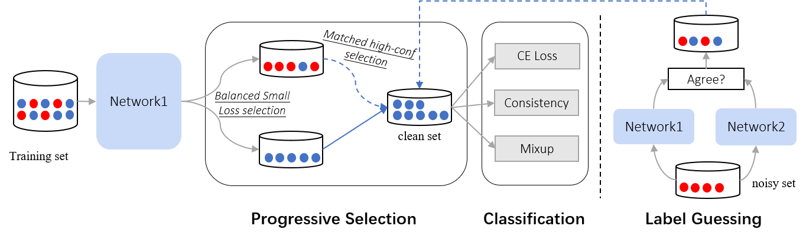
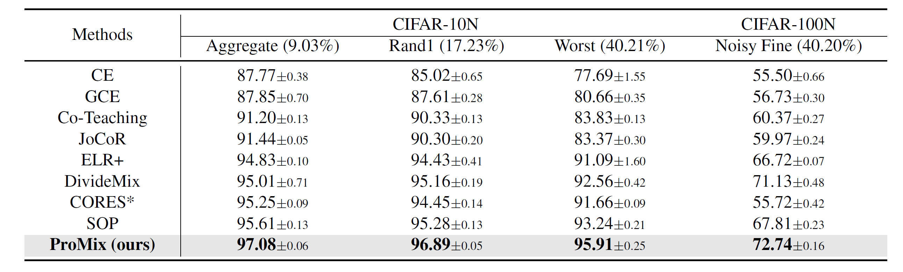

# ProMix: Combating Label Noise via Maximizing Clean Sample Utility
PyTorch Code for ProMix \
<b>Title</b>: ProMix: Combating Label Noise via Maximizing Clean Sample Utility \
<b>Authors</b>:Haobo Wang, Ruixuan Xiao, Yiwen Dong, Lei Feng, Junbo Zhao \
<b>Institute</b>: Zhejiang University, Chongqing Unveristy

The shell codes are provided in ```run.sh```. Before running, please put the following files to the ```data``` directory: ```CIFAR-10_human.pt,CIFAR-10_human.npy,CIFAR-100_human.pt,CIFAR-100_human.npy```.

### Framework


### Main Results
Accuracy comparisons on CIFAR-10N and CIFAR-100N under different noise types.



Detection ability of ProMix on CIFAR-10N datasets. Noise detection indicates the wrongly-labeled data are regarded as positive, and clean detection regards correctly-labeled ones as positive.


